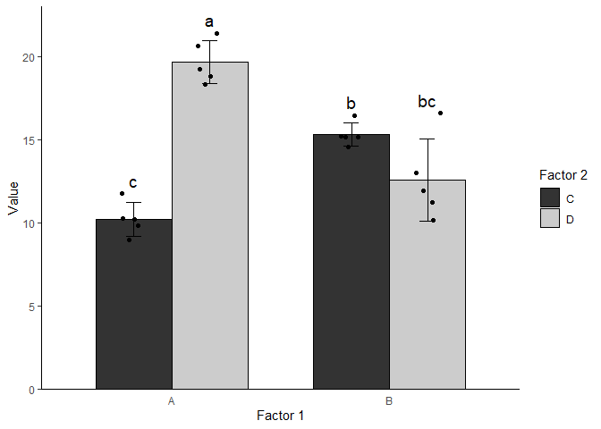

<!-- README.md is generated from README.Rmd. Please edit that file -->

# datavis

<!-- badges: start -->
<!-- badges: end -->

The goal of datavis is to simplify the creation, annotation and export
of bar plots and box plots of publication-grade quality. It is meant for
academic researchers of any programming experience - newcomers and
programming experts alike.

To a large extent, datavis wraps around the well-known [ggplot2
package](https://ggplot2.tidyverse.org/), but specializes in *very*
specific tasks (only dodged bar and box plots), aiming to increase
efficiency and accessibility to these tasks.

## Why datavis

Using the datavis functions, you can easily perform the following tasks
with very few lines of code:

-   Create bar/box plots with summary statistics, optionally including
    individual data points.

-   Annotate with custom text above bars/boxes.

-   Customize plots aesthetically.

-   Export plots in various formats for any purpose.

## Installation

You can install datavis from [GitHub](https://github.com/) with:

``` r
install.packages("devtools")
devtools::install_github("dimitriskokoretsis/datavis")
```

## Example

The following example demonstrates the use of all datavis functions to
create, annotate and export a bar plot.

### Data import and plot creation

``` r
# Data import using the fread function of the data.table package
demo.data.1 <- data.table::fread("guide/demo_data/demo_data_1.csv")

# Plot creation
library(datavis)

plot.1 <- demo.data.1 |>
  bar_point_plot(x="factor.1", # X axis grouping based on "factor.1" field
                 y="value", # Y axis value is "value" field
                 color.group="factor.2", # Color grouping based on "factor.2" field
                 x.axis="Factor 1", # Give a better title to x axis
                 y.axis="Value", # Give a better title to y axis
                 legend.title="Factor 2", # Give a better title to the legend
                 jitterwidth=0.7) # Adjust horizontal jitter of individual data points

plot.1
```


### Import of statistics data and plot annotation

``` r
# Import of statistics data from Tukey's honest significant difference (HSD) test
demo.data.1.TukeyHSD <- data.table::fread("guide/demo_data/demo_data_1_TukeyHSD.csv")

demo.data.1.TukeyHSD
#>    HSDgroups factor.1 factor.2
#> 1:         a        A        D
#> 2:         b        B        C
#> 3:        bc        B        D
#> 4:         c        A        C
```

``` r
# Annotation of original plot
plot.1.TukeyHSD <- plot.1 |>
  plot_stats(d=demo.data.1.TukeyHSD, # The data.frame containing the labels to be plotted.
             labels="HSDgroups", # The name of the labels column in the supplied data.frame.
             position="dodge") # Positioning of labels in the X dimension.
                               # See function's documentation for details.

plot.1.TukeyHSD
```



### Plot export

``` r
plot.1.TukeyHSD |>
  plot_save(filepath="guide/demo_plots/plot_1_TukeyHSD", # Path to export files
            height=4,width=5)
#> Plot "plot_1_TukeyHSD" saved as pdf, png, svg and Rds in /guide/demo_plots
```

You’ll still need to render `README.Rmd` regularly, to keep `README.md`
up-to-date. `devtools::build_readme()` is handy for this. You could also
use GitHub Actions to re-render `README.Rmd` every time you push. An
example workflow can be found here:
<https://github.com/r-lib/actions/tree/v1/examples>.

In that case, don’t forget to commit and push the resulting figure
files, so they display on GitHub and CRAN.
