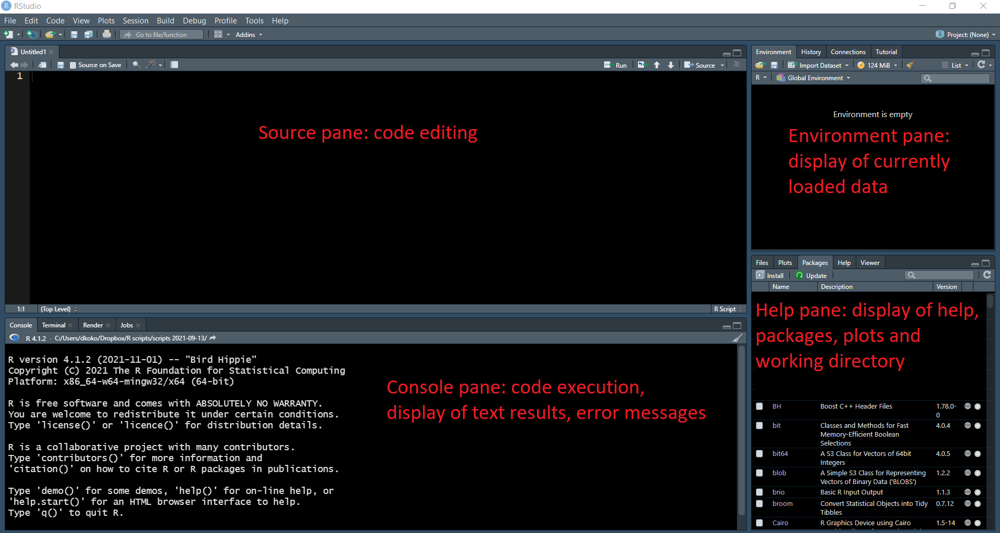

```{r setup, include=FALSE}
library(knitr)
knitr::opts_chunk$set(warning=FALSE,message=FALSE) 
```

# Introduction and motivation

This is a guide to using R and the `datavis` package for programmatic data visualization. `datavis` is designed to simplify the creation, annotation and export of bar plots and box plots of publication-grade quality.

The guide is meant for relative newcomers to programmatic data visualization, but `datavis` itself is meant for academic researchers of any programming experience - newcomers and programming experts alike.

The source code of the `datavis` package can be found in its GitHub repository: <https://github.com/dimitriskokoretsis/datavis>

## Why to use programming for data analysis and visualization

Programming offers many benefits to data analysis, processing and visualization, in relation to spreadsheets. The most obvious benefit is endless possibilities for automating tasks. However, the most compelling argument for the use of programming instead of a spreadsheet application (such as Excel) is **reproducibility** of data analysis.

6 months after an analysis is done, there is very little chance that the person who performed it will remember details about it -let alone others who might also need to access it- so transparent documentation is needed.

A spreadsheet may contain primary data, processed data, plots and possibly notes. All the ingredients for documentation are available, and experienced Excel users may have very efficient routines for transparent documentation. But unless there is a well-described rigid structure, cells with primary and processed data are not readily distinguishable between one another to a reader.

**Spreadsheets *allow* transparency, but programming *enforces* it.**

Programming with R or any other scripting language separates data entry from data processing. It can read primary data from table files (created with Excel or any text editor), and the processing is dictated by code.

The code is stored in an R script or R notebook. This is a set of sequential commands that dictate exactly how to process, analyze and visualize the data.

The main advantages of this approach are:

-   You can keep track of all data processing and analysis steps easily and make sense of them at any point in the future.

-   You can easily modify the data processing and analysis by modifying the code.

-   You can share the code so other others know exactly how the data was processed.

-   The primary data is never changed, only read.

-   After the initial learning curve, it's less time-consuming and prone to handling errors than click-based procedures.

A good elaboration of these arguments, as well as a basic introduction to R can be found in Jesse Sadler's blog post, 'Excel vs R: A Brief Introduction to R': <https://www.jessesadler.com/post/excel-vs-r/>

Relative newcomers to R may also want to check out the [R language essentials] section at the end of this guide.

# Getting started

If R and RStudio are already installed in your system, skip to the [Installing `datavis` and other packages] section.

## R language installation

Download and install the latest version of R in your system through this website: <https://www.r-project.org/>

## RStudio installation and workspace

R comes with its own integrated development environment (IDE), but it is quite limiting. **RStudio** is the most popular IDE for R. It is free and offers many advantages over the default R IDE. Download and install the desktop version through this website: <https://www.rstudio.com/>.

The RStudio workspace consists of 4 main parts or panes (figure 1):

1.  The source pane is for writing and editing R scripts and R notebooks (see [Data processing code] section for more information). To execute a line of code from the source pane, place the cursor on it and press Ctrl+Enter. To execute more lines or part of a line, highlight the part to be executed and press Ctrl+Enter. For code execution on Mac, press cmd+Enter. If working on an R notebook, code is written in chunks that can also be executed as discrete units and results are displayed below each code chunk (see [Start an R notebook] for more information).

2.  The console pane is essentially a command line interface that executes R commands. This is where the code in your R script or R notebook is executed and where results, warnings and errors are displayed. You can also write and execute code in the console pane directly, but each line is executed immediately after pressing Enter and cannot be saved. It is useful for performing tasks that are not directly related to any project (such as installing packages), performing one-time-only tasks (such as creating a subdirectory) or for testing a line of code before adding it to your R script or R notebook. Throughout this guide, it will be explicitly stated if a piece of code should be written in the console pane.

3.  The environment pane displays all variables that are currently loaded in the R environment (see [Variables] section for more information).

4.  The last pane has various purposes, the Help tab being its most useful. This is where the documentation of packages and their functions are viewed. Other common uses of this pane are the Files tab (displays the working directory), the Packages tab (displays the available R packages) and the Plots tab (displays plots upon request).



## R packages

R can perform many basic tasks with its own built-in functionality (*base R*), but one of its core assets is its extensibility with packages. An R package is a bundle of functions and their documentation (see [Functions] section for more information), usually targeted for specialized tasks. They are developed and quality-controlled by the R user community and are available for free. `datavis` itself is also an R package.

The vast majority of deployed packages is hosted by the Comprehensive R Archive Network or CRAN (<https://cran.r-project.org/>) and a smaller number is hosted by the Bioconductor project (<https://www.bioconductor.org/>), specializing in bioinformatics applications.

Development versions of deployed packages or packages under development -such as `datavis`- are usually hosted by GitHub (<https://github.com/>).

### Installing `datavis` and other packages

Before using any R package for the first time, it needs to be installed in your system. Internet connection is necessary for downloading packages.

Any CRAN-hosted package can be installed by running the code `install.packages("package.name")`. To install multiple packages at once, run the code `install.packages(c("package.name.1","package.name.2",...))`. `c()` is a special function that puts together many elements in a vector (see [Vectors] section for more information).

> **Note:** Do not write code to install packages in an R script or R notebook. Installing packages is not part of any analysis, it only needs to be done once in your system. Perform the installation of each package from the console pane, before using it for the first time.

GitHub-hosted packages can be accessed by using the CRAN-hosted `devtools` package. To install `devtools` and use it to install `datavis`, execute the following piece of code.

```{r,eval=FALSE}
# Install devtools package from CRAN
install.packages("devtools")

# Install datavis package from my GitHub repository
devtools::install_github("dimitriskokoretsis/datavis")
```

To compile R notebooks into HTML reports (see [Render report] section for more information), the CRAN-hosted `knitr` and `rmarkdown` packages are also needed. Run the following line to install them.

```{r,eval=FALSE}
install.packages(c("knitr","rmarkdown"))
```

### Using packages

After a package is installed, it needs to be loaded before use in each R session. If a package is necessary for your analysis, load it in the beginning of your R script or R notebook. To load a package, enter the line `library(package.name)` (for example `library(datavis)`).

Note that, in contrast to the `install.packages` function, the `library` function must not have quote marks around the package name.

To browse the documentation of any package, click on its name in the Packages tab of the Help pane.

To view the help file of a specific function, find it by browsing its documentation or run `help(function.name)` in the console pane (only works if the package is currently loaded).

# Proposed workflow

## Project components

There are many ways to use R and everyone is encouraged to develop their routines, but any project will mainly consist of 3 components: the primary data, the processing code and the processed results.

### Primary data

The data to be processed, analyzed or visualized. For the type of analyses described in this guide, the primary data is table data in text files, with values organized in rows (*records*) and columns (*fields*). It is important that each field has values of the same type (e.g. numeric or character).

Example file types are comma-separated values (.csv file extension) or tab-separated values (.txt file extension). R can also import Excel sheets by using a specialized package, but this is beyond the scope of this guide (see the [`readxl` package](https://readxl.tidyverse.org/) for more information).

### Data processing code

The commands dictating the data processing and export of results. These are contained in R scripts or R notebooks and edited in RStudio's source pane. It is where you document the methods of your analyses and your notes for a given project.

R scripts (.R file extension) can only contain code and comments, while R notebooks (.Rmd file extension) can combine code, formatted text and other content if needed (e.g. images) and can be rendered in shareable reports (see [Start an R notebook] and [Render report] for more information).

### Results

The outcome of the processing. It can be processed data or visualizations.

## Start a project

### Start project directory

Create a folder for your project and name it as you prefer. This will be the project's *working directory*. To set it as working directory for the R session, start RStudio and run the following command in the console pane.

Substitute the quoted part with the *absolute* or *relative* path to the project folder you just created (see [Directory navigation] section for more information).

```{r,eval=FALSE}
# Do not copy and paste this command.
# Substitute the quoted part with the path to your project folder.
setwd("path/to/project/folder")
```

It is considered good practice to have an internal structure in each project folder, especially for large projects. This means that primary data, processed data and visualizations should be separate from one another. In the simplest case, there can be two appropriately named subfolders, for primary data and visualizations.

To follow this guide interactively, use the mock data used throughout this guide to demonstrate the use of the `datavis` functions.

Download the following zip file with mock data and extract its contents in the project's working directory: [demo_data.zip](<https://github.com/dimitriskokoretsis/datavis/raw/master/guide/demo_data.zip>). This should create a subfolder named "demo_data" with 2 CSV files.

Next, create a subfolder for the resulting visualizations -named "demo_plots"- by running the following line in the console pane.

```{r,eval=FALSE}
dir.create("demo_plots")
```

### Start an R notebook

I recommend performing the analysis for a project in an R notebook rather than an R script, as it can easily integrate code, results and text and be rendered in a shareable report (see [Render report] for more information). Start a new R notebook by selecting *File \> New File \> R Notebook*.

R code is written in code chunks within the notebook. Any code demonstrated in this guide needs to be typed in a code chunk to be executed. Select *Code \> Insert Chunk* to create a new code chunk in the R notebook. Press the green arrow on a code chunk's top right corner to execute it. Press the downward arrow on a code chunk's top right corner to execute sequentially all chunks above it. Executing a code chunk displays its results (if any) right below it.

Save the R notebook in the project's working directory. Whenever you open this R notebook, the working directory of the R session will be automatically set to this folder.

## Load `datavis` package

After the `datavis` package is installed (see [Installing `datavis` and other packages]), it must be loaded onto the R environment to be used. Write the `library(datavis)` line in a code chunk at the beginning of your R notebook.

```{r}
library(datavis)
```

To access the `datavis` functions' documentation, run any of the following lines in the console pane at any point after loading `datavis`.

```{r,eval=FALSE}
help(bar_point_plot)
help(box_mean_plot)
help(plot_stats)
help(plot_save)
```

## Data import

R can read primary data from files and import it in its environment for further processing, leaving the primary data file unchanged.

The data structure used in R for this purpose is called `data.frame` - or `data.table`, if using the `data.table` package. The differences between the two are beyond the scope of this guide, so they will be referred to as `data.frame`s from now on (see [Data frames] section for more information).

One way to import data from a file to select *Import Dataset \> From text* in the Environment pane and find the data file in the dialog window.

This is a valid way for R to import data, but I encourage you to do as much as possible programmatically, i.e. with code in your R notebook. The advantage of this is that all parameters for data entry are stored for ever in your notebook. You will never have to search for your data file again - all you will have to do is execute the code that you have written.

We will import data from a file named "demo_data_1.csv" and located in the "demo_data" subfolder. The data will be loaded in the R environment as a `data.frame` variable with the name `demo.data.1` (see [Variables] section for more information).

```{r}
library(data.table)

demo.data.1 <- fread("demo_data/demo_data_1.csv")
```

The `<-` symbol assigns the value on its right to the name on its left side (see [Variables] section for more information).

The `fread` function (as in "fast read") is part of the `data.table` package and reads a tabular file into an R `data.frame`. This is why we needed to load the `data.table` package with the line `library(data.table)`.

We have now created a `data.frame` with the name `demo.data.1`.

We will now call the name of our new `data.frame` to display it.

```{r}
demo.data.1
```

## Data analysis and visualization

### Plain visualization

The `datavis` functions **`bar_point_plot`** and **`box_mean_plot`** are used for numeric data grouped in categories and produce vertical bar plots and box plots. Both are designed to show the individual data points by default, offering the option to hide them if desired. An adjustable horizontal jitter is applied to the individual data points, to avoid overlap between one another.

We will use the `bar_point_plot` function to create a bar plot from `demo.data.1` showing the mean value and error bar showing the standard deviation for each group. We want to split the data along the x axis based on "factor.1" and in color groups based on "factor.2".

The calculations for mean and standard deviation are performed automatically. All it needs from the user is the `data.frame` and the names of its columns to be used.

We will create a bar plot from the `demo.data.1` `data.frame` and name it `plot.1`.

```{r}
plot.1 <- demo.data.1 |>
  bar_point_plot(x="factor.1", # X axis grouping based on "factor.1" field
                 y="value", # Y axis value is "value" field
                 color.group="factor.2", # Color grouping based on "factor.2" field
                 x.axis="Factor 1", # Give a better title to x axis
                 y.axis="Value", # Give a better title to y axis
                 legend.title="Factor 2", # Give a better title to the legend
                 jitterwidth=0.7) # Adjust horizontal jitter of individual data points
```

The `|>` symbol, called a **pipe**, feeds the value on its left side as input to the function on its right side (see [Nested and piped function calls] section for more information). In this case, we feed the `demo.data.1` `data.frame` as first argument to the `bar_point_plot` function.

Other function arguments (`x`, `y`, `color.group`, etc) are also needed by the function. Execute the line `help(bar_point_plot)` for details on this function's arguments and see [Arguments and default values] section for general information on setting function arguments.

As we did for the `data.frame`, we will next call the plot's name to display it.

```{r}
plot.1
```

Run `help(bar_point_plot)` or `help(box_mean_plot)` to view documentation on the functions and all of their arguments.

### Plot statistical analysis information

Statistical analysis information is usually depicted on a bar plot or box plot as annotations above the bars or boxes.

> **Note:** The choice of statistical test and its parameters varies from case to case and is left to the discretion of the user. There are usually many statistical tests to choose from and R offers a wide array of options, as it is specifically designed for this. However, the topics of statistical analysis and its implementation in R are beyond the scope of this guide.

In this example, Tukey's HSD test was applied to compare all samples with one another (see [For the statistically curious] section for more details on this specific analysis). The results of this analysis are stored in a file named "demo_data_1_TukeyHSD.csv", located in the "demo_data" folder. We import it as a `data.frame` named `demo.data.1.TukeyHSD`.

```{r}
demo.data.1.TukeyHSD <- fread("demo_data/demo_data_1_TukeyHSD.csv")

demo.data.1.TukeyHSD
```

This data means that, according to Tukey's HSD test and with a P-value threshold of 0.05:

-   Sample A:D is significantly different from all other samples (no other sample belongs to group a)

-   Samples B:C and A:C are significantly different from each other (they belong to group b and c, respectively)

-   Sample B:D is not significantly different from either B:C or A:C samples (belongs to groups b and c)

To visualize this information on our original plot, we will use the `plot_stats` function.

```{r}
plot.1.TukeyHSD <- plot.1 |>
  plot_stats(d=demo.data.1.TukeyHSD, # The data.frame containing the labels to be plotted.
             labels="HSDgroups", # The name of the labels column in the supplied data.frame.
             position="dodge") # Positioning of labels in the X dimension.
                               # See function's documentation for details.

plot.1.TukeyHSD
```

Run `help(plot_stats)` for more information on the function and all of its arguments.

#### For the statistically curious {.unnumbered}

We have performed two-way analysis of variance (ANOVA) accounting for additive and interaction effects, followed by post-hoc comparisons with Tukey's Honestly Significant Difference test ([Tukey's HSD test](https://en.wikipedia.org/wiki/Tukey%27s_range_test)). This test makes all pairwise comparisons between samples and groups them according to significant differences below a P-value threshold. We used a P-value threshold of 0.05. Therefore, if a comparison gives a P-value below 0.05, the compared samples are considered significantly different.

### Plot post-processing

There are further aesthetic modifications that we might want to make. These are not performed by `datavis` functions. Instead, we simply *add* an element to our plot, using the grammar of graphics of the `ggplot2` package. We first load the `ggplot2` package.

```{r}
library(ggplot2)
```

In this case, we will move the legend to another spot: inside the plotting area, on its top left corner. To do this, we add a `theme` element specifying the legend's position with a 2-element vector. These are coordinates, ranging from 0 to 1.

The first coordinate sets position on the horizontal dimension (0 for left-most, 1 for right-most) and the second coordinate sets position on the vertical dimension (0 for bottom, 1 for top).

```{r}
plot.1.TukeyHSD.legend.top.left <- plot.1.TukeyHSD +
  theme(legend.position=c(0.1,0.9))

plot.1.TukeyHSD.legend.top.left
```

Adding elements on top of one another is the "canon" way of creating and modifying plots with the `ggplot2` package.

See [Plot post-processing: quick guide] section for more possible modifications. For a comprehensive guide to the capabilities of `ggplot2`, visit its website: <https://ggplot2.tidyverse.org/>

### Plot export

The end goal of any data visualization is to get plots that can be used for various purposes. R can export plots of any kind to any format.

#### Plot file formats {.unnumbered}

##### Raster-based and vector-based plots {.unnumbered}

The two main categories of image files for plots are **raster-based** and **vector-based** formats.

The information is stored differently in each type of format. In a raster-based format the information is pixel data created (*rendered*) at the time of production. In a vector-based format the information is shape and path coordinates that are used to render the plot at the time of viewing. Both have advantages and disadvantages, and usually different formats are used in different situations.

**Vector-based format advantages:**

-   The display resolution is maintained at any scale. Because the plotting is based on coordinates, there are no pixel artefacts when scaling up or down. It is ideal for printing in large sizes and displaying on large screens or sheets.

-   A vector-based plot can be modified afterwards by graphic design software, such as Adobe Illustrator or Affinity Designer.

**Vector-based format drawbacks:**

-   Proper display of a vector-based image is dependent on the software that is used to render it. Because of this, there might be cases where a plot is displayed with imperfections -or even that important parts are missing- if there are incompatibilities between the production and the rendering software. That said, PDF plots are very reliably read by Adobe Reader in most cases, though they might be difficult to import in other programs.

-   Extremely busy plots with high complexity have very large volume and take a long time to render for viewing.

**Raster-based format advantage:**

-   Because of the pixel nature of raster-based images, they will be displayed the same, regardless of the display software.

**Raster-based format drawback:**

-   There are pixel artefacts when displaying in larger scale. This can be mitigated by increasing the resolution in DPI (dots per inch) when producing the image. Usually, 600 DPI is enough for a good quality plot. Be mindful of what resolution your journal of interest asks for!

| **Properties**     | **Raster images**                     | **Vector graphics**                                            |
|------------------|---------------------|---------------------------------|
| Information type:  | Pixel data                            | Shape and path coordinates                                     |
| Size on disk:      | Depends on image size & resolution    | Depends on complexity                                          |
| Rendering:         | During production                     | During viewing                                                 |
| Display fidelity:  | Software-independent                  | Software-dependent                                             |
| Scaling:           | With pixel artefacts                  | Retains quality in any scale                                   |
| Good for:          | Importing in MS Office, quick sharing | Displaying in large size, editing with graphic design software |
| Example file types: | PNG, TIF                            | SVG, PDF, EPS                                               |

##### Plots as R data files {.unnumbered}

After a plot is exported, there is little possibility to change its dimensions or any other aesthetic parameters (as in the [Plot post-processing] section). Vector-based plots can be processed with graphic design software, but this entails the danger to distort the information. If a plot needs aesthetic changes, the best way is make them within the R environment.

One way to do this is to go back to the R notebook that was used to produce the plot and make the necessary adjustments.

Another way is to export plots as R objects (.Rds files), which can be imported back to the R environment for editing at any later point. .Rds files are stored as data readable by R, and any R object can be exported as .Rds.

#### Export plots with the `plot_save` function {.unnumbered}

The **`plot_save`** function exports any plot created by `ggplot2` in .Rds, raster- and vector-based formats (.png, .pdf, .svg), in the desired dimensions.

```{r,message=TRUE}
# Export plot to a subfolder with specified dimensions
plot.1.TukeyHSD.legend.top.left |>
  plot_save(filepath="demo_plots/plot_1_TukeyHSD_legend_top_left", # Path to export files
            height=4,width=5) # Dimensions in inches
```

Run `help(plot_save)` for more information on the function and all of its arguments.

To import an .Rds file into the R environment, simply open it from the file browser with RStudio. In the prompt, enter an appropriate variable name for the object. Plots imported from .Rds files can be processed by R just like any other plot.

## Workflow summary

The diagram in figure 2 summarizes the workflow described in the previous sections. The `datavis` functions are indicated with **orange** ellipses. Functions of other R packages are indicated with yellow ellipses and data objects are indicated with grey boxes.

Data is imported as a `data.frame` into the R environment from a comma-separated value file (.csv) with the `fread` function of the `data.table` package.

Initial plotting (`bar_point_plot` or `box_mean_plot`) and statistical analysis of the data are performed independently, and converge to update the initial plot (`plot_stats`).

Post-processing with `ggplot2` allows further aesthetic modifications (also see [Plot post-processing: quick guide] section).

The plot is finally exported into various file formats with `plot_save`.

Dotted lines indicate alternative paths: Statistical annotation and/or post-processing can be skipped if not necessary.

```{r,echo=FALSE}
library(DiagrammeR)
library(DiagrammeRsvg)
library(rsvg)
nodes <- fread("diagram/datavis_nodes.csv")
edges <- fread("diagram/datavis_edges.csv")

nodes[,`:=`(id=.I,fixedsize="false",color="black",fontcolor="black",fontsize=10,label=gsub("\\\\n","\n",label))]
nodes[type=="object",`:=`(shape="rectangle",fillcolor="grey90")]
nodes[type=="action",`:=`(shape="ellipse",fillcolor="lightyellow")]
nodes[type=="function",`:=`(shape="ellipse",fillcolor="orange")]
nodes[,cluster:=gsub("\\\\n","\n",cluster)]
setcolorder(nodes,c("id","label","type","cluster","fixedsize","shape","fillcolor","fontcolor","fontsize"))

edges[,`:=`(id=.I,color="grey50",from=gsub("\\\\n","\n",from),to=gsub("\\\\n","\n",to))]
edges[,style:=fifelse(rel=="optional","dotted","solid")]
setcolorder(edges,c("id","from","to","rel","style"))

edges[nodes,
      from:=i.id,
      on=c(from="label")]

edges[nodes,
      to:=i.id,
      on=c(to="label")]

edges[,`:=`(from=as.integer(from),to=as.integer(to))]
  
graph <- create_graph(nodes_df=nodes,edges_df=edges) |>
  add_global_graph_attrs(attr="layout",value="dot",attr_type="graph") |>
  add_global_graph_attrs(attr="fontsize",value=20,attr_type="node")

graph |> generate_dot() |> write("diagram/datavis.gv")

graph |> generate_dot() |> grViz() |> export_svg() |> charToRaw() |> rsvg_pdf("diagram/datavis.pdf",height=500)
```


## Render report

The point of performing data analysis and visualization within an R notebook is that it can combine text, code and results. It can guide the reader through your thoughts, actions and results, allowing full transparency in your analysis.

At any point during the production of an R notebook, click *File \> Knit Document* to render (*knit*) it into an HTML report that can be shared. During the knitting of the report, all the text and code is formatted and executed sequentially, from the start to the end of the R notebook. The HTML report will be saved in the project's working directory.

Text formatting within the report is based on integration of R with Markdown, a document formatting language, into *R Markdown*. R Markdown's output capabilities extend to formats beyond HTML, such as PDF, MS Word, and others. For more information on the capabilities of R Markdown, visit its website: <https://rmarkdown.rstudio.com/>

# Plot post-processing: quick guide

After the creation of a plot, `ggplot2` offers many options for further aesthetic modification. These are usually done by adding another element on the existing plot object. Below, I describe the modifications that I have found most useful. These can be copied and pasted on your R notebook.

## Modify x axis

### Rotate by 45 degrees counter-clockwise

Sometimes the labels for the x axis are too long to fit in a plot with reasonable dimensions. A common solution is to rotate each label by 45 degrees counter-clockwise, so that all are legible.

To rotate all x axis labels, add the following `theme` element to the plot.

```{r}
plot.1.TukeyHSD.rotated.x.axis <- plot.1.TukeyHSD +
  theme(axis.text.x = element_text(angle=45,vjust=1,hjust=1))

plot.1.TukeyHSD.rotated.x.axis
```

### Rotate back to horizontal position

To rotate x axis labels back to horizontal position, add the following `theme` element to your plot.

```{r}
plot.1.TukeyHSD.rotated.back.x.axis <- plot.1.TukeyHSD.rotated.x.axis +
  theme(axis.text.x = element_text(angle=0,hjust=0.5))

plot.1.TukeyHSD.rotated.back.x.axis
```

### Italicize x axis labels

#### All x axis labels to italics {.unnumbered}

To italicize all x axis labels, add the following `theme` element to your plot.

```{r}
plot.1.TukeyHSD.all.x.italics <- plot.1.TukeyHSD +
  theme(axis.text.x=element_text(face="italic"))

plot.1.TukeyHSD.all.x.italics
```

#### Specific x axis labels to italics {.unnumbered}

Italicize the "B" label specifically, by adding the following `scale_x_discrete` element to the plot.

"factor.1" is the name of the x axis factor, same as the name of the original `data.frame` column.

```{r}
plot.1.TukeyHSD.B.italics <- plot.1.TukeyHSD +
  scale_x_discrete("factor.1",labels=expression("A",italic("B")))

plot.1.TukeyHSD.B.italics
```

## Modify legend

### Move legend

#### To certain positions outside of plotting area {.unnumbered}

Add a `theme` element, setting `legend.position` to "top", "bottom", "left", or "right".

```{r}
plot.1.TukeyHSD.legend.top <- plot.1.TukeyHSD +
  theme(legend.position="top")

plot.1.TukeyHSD.legend.top
```

#### Inside plotting area {.unnumbered}

Set `legend.position` to a 2-element numeric vector with values ranging from 0 to 1. `c(0,0)` positions legend to bottom left, while `c(1,1)` positions legend to top right.

```{r}
plot.1.TukeyHSD.legend.top.left <- plot.1.TukeyHSD +
  theme(legend.position=c(0.1,0.9))

plot.1.TukeyHSD.legend.top.left
```

### Italicize legend labels

#### All legend labels to italics {.unnumbered}

To italicize all legend labels, add the following `theme` element to your plot.

```{r}
plot.1.TukeyHSD.all.legend.italics <- plot.1.TukeyHSD +
  theme(legend.text=element_text(face="italic"))

plot.1.TukeyHSD.all.legend.italics
```

#### Specific legend labels to italics {.unnumbered}

Italicize the "D" label specifically, by adding the following `scale_fill_grey` element to the plot.

"factor.2" is the name of the color grouping factor, same as the name of the original `data.frame` column.

```{r}
plot.1.TukeyHSD.D.italics <- plot.1.TukeyHSD +
  scale_fill_grey("factor.2",labels=expression("C",italic("D")))

plot.1.TukeyHSD.D.italics
```

### Remove legend completely

Add a `theme` element, setting `legend.position` to "none".

```{r}
plot.1.TukeyHSD.no.legend <- plot.1.TukeyHSD +
  theme(legend.position="none")

plot.1.TukeyHSD.no.legend
```


# R language essentials

## Directory navigation

A directory is simply a folder in the file system. Functions such as `fread` and `plot_save` require the location of a file for its input or output. To describe this information, we write a path from a starting point in the file system, to the folder or file of our interest. Example: "dir_1/dir_2/file.csv".

### Absolute and relative paths

An absolute path always starts at the top level of the file system, and has the complete information needed to locate a file or folder in a machine.

A relative path can start at any point in the file system and has the information to locate a file or folder from this starting point. As relative paths don't necessarily start from the top level of the file system, it is possible to move upwards by writing "../". For example, to point to a file located 2 levels above: "../../file.csv".

Using relative paths, only local information is needed to point to a file if it's below or relatively close to the starting point. Different computers most likely don't have the same file system structure globally. Relative paths are more convenient for sharing work with others, as a shared directory can have the same structure locally. Only relative paths have been used for the purposes of this guide.

At any moment during an R session, the starting point for relative paths is called *working directory*.

### Working directory

During an R session there is always a working directory, serving as a starting point for locating files.

If an R script or R notebook is opened from the file explorer, RStudio automatically sets the working directory to the folder containing the file. If you open RStudio program from its own shortcut, the working directory is set to your Documents folder.

Make sure the working directory of your R session is set properly, otherwise relative paths will not work. To see the absolute path to the current working directory, run the line `getwd()` in the console pane at any moment. To change the working directory during an R session, run the line `setwd()` in the console pane, specifying the path to the directory of your choice in the brackets, between quote marks. Both absolute and relative paths are acceptable.

## Variables

Variables are the building blocks of data in any programming language. Any type of data loaded in the R environment is temporarily stored in variables, for further processing or export to a file.

We can create a variable as follows:

```{r}
a <- 5
```

The `<-` symbol resembles a left arrow and in R it means *"assign the value of what is on the right side to the name on the left side"*. So this piece of code creates a variable named `a` and assigns to it the value 5.

After its assignment, we can call the name of a variable to see its value or use it calculations, as follows:

```{r}
b <- a + 3
```

This piece of code assigns the value of `a + 3` (in this case, 8) to `b`.

`a` and `b` are `numeric` variables in this case, but we can also create `character` variables, such as `c <- "hello"`. These are quite simple types of variables, but virtually anything can be assigned to a variable name. Vectors, data frames and even plots, are all assigned to variable names (see [Vectors] and [Data frames] for more information).

The name of a variable is meant to signify what it represents. You can establish naming conventions within your own or your group's projects to facilitate collaboration. R allows dots (.) and underscores (_) to separate words in a variable name. Names are case-sensitive, meaning that `a` is a different variable from `A`.

> **Note**: Assigning a value to a variable name that already exists will overwrite the existing value. Be mindful not to overwrite important variables during your analyses.

### Vectors

In R, a vector is a group of elements of the same type, arranged in a specific order. We can create a vector in R as below:

```{r}
d <- c(2,7,3,6,4)
```

`c()` is a special function that creates a vector with the elements inside the brackets. So this piece of code creates a variable named `d` and assigns to it the values (2,7,3,6,4) in this specific order. To call a specific element within `d`, refer to its position in square brackets (`[]`), as below:

```{r}
# Show the 2nd element of d
d[2]
```

An element within the vector can be similarly changed as below:

```{r}
# Change the value of the 2nd element of d to 3
d[2] <- 3
d
```


Several R built-in functions use vectors as input. For example, to find the sum of all elements in vector `d`:

```{r}
sum(d)
```

Vectors of the same length can be added, subtracted, multiplied and divided element by element:

```{r}
e <- c(4,2,8,5,3)
d + e
```

Vectors are a generalization of single values. This means that even single values like `a <- 5` and `c <- "hello"` are considered vectors of length 1.

### Data frames

A data frame is a table structure with values organized in rows (*records*) and columns (*fields*). It is the type of data that most resembles a spreadsheet. Each column has values of the same type (for example, `numeric`). Because of this, each column can be conveniently used in calculations as a vector. Extract specific columns in a data frame by referring to their name after a dollar sign (`$`), as below:

```{r}
# Show the field "value" of demo.data.1, as a vector
demo.data.1$value
```

R has a built-in type of data structure called `data.frame`. The functions described in this guide are based on the [`data.table`](https://rdatatable.gitlab.io/data.table/) R package, which offers a more convenient syntax than base R. This means that the `data.table` package needs to be installed in your system - which is done automatically during the `datavis` package installation. Moreover, the `datavis` functions accept both `data.table`s and base-R `data.frame`s as input.

The `fread` function of the `data.table` package can read any text file of tabular form into a `data.table`.

## Functions

If variables are the building blocks of data, **functions** are the building blocks of actions. Functions are essentially pieces of code that accept data and other parameters as input and produce an output (e.g. processed data, statistical parameters, or visualizations).

The `datavis` tools described in this very guide are functions that produce visualizations.

The main way to use a function is:

```{r,eval=FALSE}
f <- function.1(input.1 = g, input.2 = h)
```

This piece of code *calls* the function `function.1` with given values `g` as argument `input.1`, and `h` as argument `input.2`, and assigns its result to the variable `f`. `function.1` needs to have been previously defined and loaded in the R environment, and `input.1` and `input.2` are needed for `function.1` to output a result.

Functions are stored in the R environment with names, just as variables are, and the same naming rules apply.

### Function calls

#### Arguments and default values {.unnumbered}

A function may take many arguments to perform its task, but not all of them need to be given values by the user, as the user might be happy with their default values. The `datavis` functions have default values for most of their aesthetic arguments, so we only need to give values for them if we want to change them from their defaults.

The following two pieces of code produce the exact same plot.

```{r}
# All arguments are set by the user to their default values

demo.data.1 |>
  bar_point_plot(x="factor.1",y="value",color.group="factor.2",
                 x.axis=NULL,y.axis=NULL,legend.title=NULL,
                 x.order=NULL,group.order=NULL,x.first=NULL,group.first=NULL,
                 points=TRUE,barwidth=0.7,jitterwidth=1,pointsize=1,whisker.width=1,
                 mean.type="arithmetic",error.lower=NULL,error.upper=NULL)
```

```{r}
# Only necessary arguments are set by the user

demo.data.1 |>
  bar_point_plot(x="factor.1",y="value",color.group="factor.2")
```

#### Nested and piped function calls {.unnumbered}

There are two main ways to call a function. The most basic is to put all input arguments within brackets, next to the function's name. For example, to calculate the sum of elements of vector `d`, we call the `sum` function:

```{r}
sum(d)
```

An alternative way to express the same function call is the following:

```{r}
d |> sum()
```

The `|>` symbol has been used throughout this guide and is called **pipe**. The pipe essentially takes the value of its left side and feeds it as input to the function on its right side.

It makes no real difference in the simple example with `sum`, but it can make the code for complex processes much more readable.

Let's assume we need the output of a function to be fed as input to another function (e.g. the output of `function.1` being the input of `function.2`). Either of the two following function calls can perform this very task.

```{r,eval=FALSE}
# Nested function call
function.2(input.1 = function.1(input.1 = g, input.2 = h),
           input.2 = k)

# Piped function call
g |>
  function.1(input.2 = h) |>
  function.2(input.2 = k)
```

However, the nested function call is not easy to understand at first glance. The piped function call is much easier to understand:

-   `g` is fed to `function.1` as `input.1` (with its `input.2` set to `h`)

-   the result of `function.1` is fed to `function.2` as `input.1` (with its `input.2` set to `k`).

If a function has more than one input arguments, the pipe automatically assigns its left side value as the **1st input argument**.

As of R version 4.2.0 (April 2022), the `|>` pipe is more flexible: it can assign the left side to any input argument of `function.2` with the `_` placeholder. The following piece of code uses `h` as the 2nd argument of `function.1` and the output of `function.1` as the 2nd input argument of `function.2`.

```{r,eval=FALSE}
h |>
  function.1(input.1 = g, input.2 = _) |>
  function.2(input.1 = k, input.2 = _)
```
